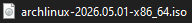
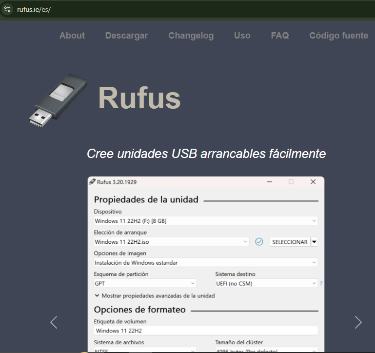
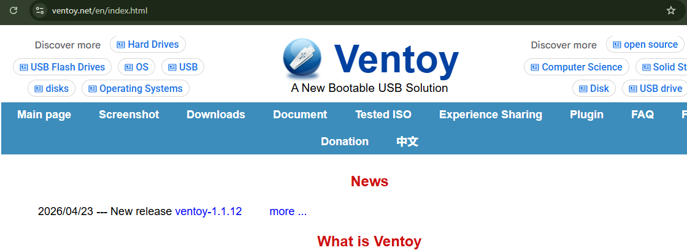
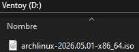
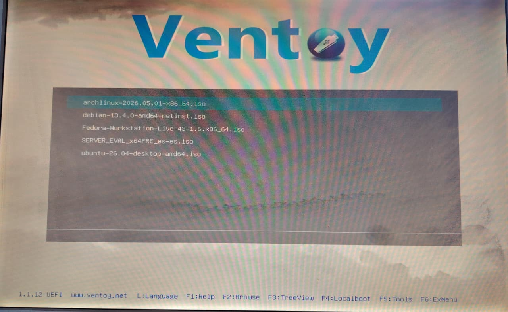

# ADVERTENCIA

Antes de comenzar con la instalación del sistema operativo, es necesario preparar un medio de arranque, comúnmente una memoria USB booteable, que contendrá la imagen ISO oficial de Arch Linux.

# Recomendaciones

* Utilizar una memoria USB de al menos 4 GB de capacidad.
* Verificar que la descarga de la ISO no esté corrupta.
* Respaldar la información importante almacenada en la memoria USB antes de instalar Ventoy, ya que el proceso inicial formatea el dispositivo.


# 1. Obtener de la imagen ISO oficial
El primer paso consiste en obtener la imagen ISO de Arch Linux desde su sitio oficial.

Página oficial de descargas:
https://archlinux.org/download/


Dentro del apartado de mirrors o servidores de descarga, se puede seleccionar el más conveniente según la región del usuario. Personalmente utilicé el mirror:

```text
geo.mirror.pkgbuild.com
```
<p align="center">
  
</p>

Una vez seleccionado el servidor, se procede a descargar la versión más reciente de la imagen ISO de Arch Linux.

# 2. Encontrar y descargar una herramienta para crear el USB booteable

Después de obtener la imagen ISO, es necesario utilizar un programa especializado para grabarla en una memoria USB.

Una de las herramientas más conocidos para esta tarea es:

* Rufus: https://rufus.ie/es/
<p align="center">
  
</p>

Sin embargo, en este procedimiento escogí:

* Ventoy: https://www.ventoy.net/en/index.html
<p align="center">
  
</p>
Ventoy ofrece una ventaja importante frente a otras herramientas tradicionales, ya que permite almacenar múltiples imágenes ISO dentro de una misma memoria USB sin necesidad de formatearla cada vez que se agrega un nuevo sistema operativo.


# 3. Preparación de la memoria USB
Una vez instalado Ventoy, se conecta la memoria USB al equipo y se ejecuta el programa para preparar el dispositivo. Posteriormente:

1. Se selecciona la memoria USB correspondiente.
2. Se instala Ventoy en el dispositivo.
3. Se copia la imagen ISO de Arch Linux directamente dentro de la memoria USB.

<p align="center">
  
</p>

A diferencia de otros programas, Ventoy no requiere realizar procesos adicionales de grabación, ya que simplemente detecta automáticamente los archivos ISO almacenados.

<p align="center">
  
</p>


# 4. Expulsión segura de la memoria USB
Después de transferir correctamente la imagen ISO, se recomienda expulsar la memoria USB de manera segura desde el sistema operativo para evitar daños en los archivos o corrupción de datos.

Una vez retirada, la memoria USB queda completamente lista para utilizarse como medio de instalación de Arch Linux.

# Pasemos a la siguiente fase: Instalación
<p align="center">
  
</p>