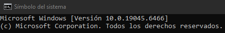
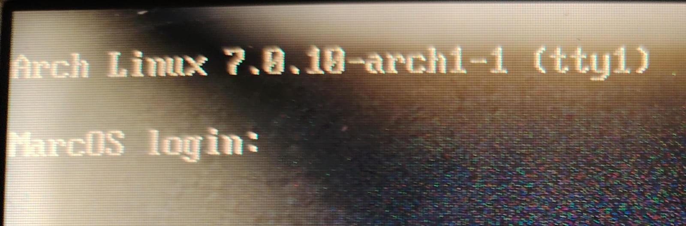
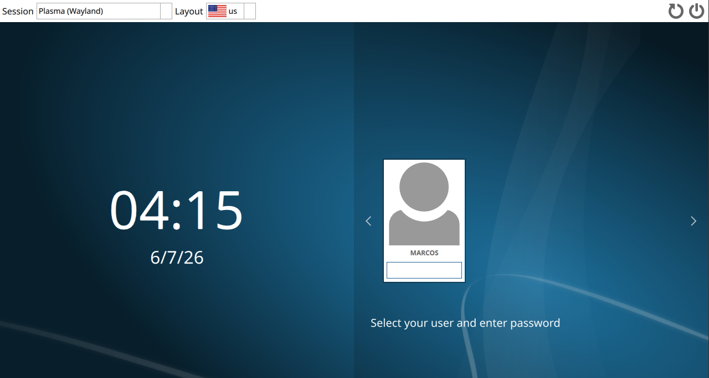
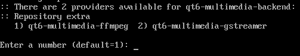

Hasta este punto se ha completado la instalación base de Arch Linux. Sin embargo, el sistema todavía funciona únicamente mediante una interfaz de línea de comandos (CLI), conocido en Windows como CMD (Símbolo de Sistema).

<p align="center">
  
</p>

Para disponer de una experiencia visual completa será necesario instalar un entorno gráfico (Desktop Environment) o un gestor de ventanas (Window Manager), los cuales proporcionan elementos como ventanas, menús, explorador de archivos, configuraciones del sistema y aplicaciones básicas para el uso diario. En otras palabras, un aspecto visual creado por un conjunto de personas para el usuario.

Si queremos compararlo en un aspecto de la vida cotidiana, entonces pensemos en la construcción de una casa en un terreno despejado, nosotros elegimos el tamaño, los materiales, la pintura, etc. Toda la construcción de la casa, incluyendo cableado, es la instalación de Arch Linux. En cuanto a los muebles, aparatos electrónicos, etc., es el entorno gráfico, la comodidad que queremos para el uso del sistema operativo.

Existen múltiples alternativas disponibles dentro del ecosistema Linux, cada una con características, requisitos de hardware y filosofías de diseño diferentes.


# Importante

Los procedimientos descritos a continuación instalan únicamente los componentes esenciales de cada entorno gráfico, tales como; 

>* Pantalla de bloqueo, inicio de sesión y escritorio. Dependiendo del entorno gráfico
>* Dolphin ("Explorador de archivos" de Windows) 
>* Preferencias del sistema ("Configuración"de Windows).
>* CLI 

El entorno gráfico que instalé se llama "KDE Plasma". Debido a su comportamiento y la gran variedad de diseños que podemos configurar.


# Objetivo
Mantener una instalación ligera y funcional, permitiendo que cada usuario agregue posteriormente las aplicaciones y herramientas que considere necesarias.


# Recomendación
Instalar únicamente uno de los entornos descritos en esta sección para evitar conflictos innecesarios y mantener una configuración sencilla de administrar.


# Línea de código
En el anterior apartado "Instalación" se mostraron comandos propios de Arch Linux, pero, ¿qué es "sudo pacman"?, ¿por qué es importante?

Cuando queremos instalar algún paquete en esta distribución, siempre comienzan con la instrucción:

```bash
sudo pacman -S
```

**"sudo"** otorga permisos administrativos temporales para realizar cambios en el sistema.

**"pacman"** se encarga de gestionar la descarga e instalación del software.

**"-S"** especifica que la operación a realizar será la instalación de uno o varios paquetes provenientes de los repositorios configurados.

A partir de esta línea de código, los nombres que aparecen después corresponden a los paquetes que serán instalados y que conformarán el entorno gráfico seleccionado.


# Inicio de sesión

Después de reiniciar el sistema tras la instalación de Arch Linux, aparecerá una consola de acceso similar a la siguiente:

<p align="center">
  
</p>

Debemos introducir el nombre de usuario creado durante la instalación y posteriormente la contraseña correspondiente. Una vez autenticado correctamente, se mostrará una terminal lista para recibir comandos.

Desde este punto se podrá instalar cualquiera de los siguientes entornos gráficos.


# KDE Plasma

Es uno de los entornos gráficos más completos y personalizables disponibles para Linux. Su interfaz resulta familiar para usuarios provenientes de Windows y ofrece una gran cantidad de herramientas integradas para la administración del sistema.

<p align="center">
  
</p>


```bash
sudo pacman -S plasma-desktop dolphin konsole systemsettings sddm
```

**"plasma-desktop"** instala el escritorio principal de KDE Plasma.

**"dolphin"** es el administrador de archivos oficial. El "Explorador de archivos" por parte de Windows.

**"konsole"** es la terminal oficial. Es decir, el "Símbolo de sistema" de Windows.

**"systemsettings"** es el centro de configuración, el nombre del programa es "Preferencia del sistema". Conocido en Windows como "Configuración".

**"sddm"** es el gestor de inicio de sesión que utiliza este entorno gráfico, como se muestra en la captura.


Después aparecerá lo que aparece en la siguiente imagen:

<p align="center">
  
</p>

solicitando seleccionar un proveedor para el paquete **"qt6-multimedia-backend"**. Los proveedores (providers) son implementaciones alternativas que permiten ofrecer la misma funcionalidad mediante diferentes tecnologías. En mi caso elegí 1 (por defecto).

Posteriormente nos preguntará si estamos seguros de instalar, escribiremos "Y" o apretamos la tecla "Enter", de ahí comenzará a instalar.


Antes de reiniciar, habilitamos el gestor de arranque de inicio de sesión:

```bash
sudo systemctl enable sddm
```


Por último, reiniciamos el sistema:

```bash
reboot
```

Cuando cargó correctamente, aparecerá la pantalla de inicio de sesión de KDE Plasma.


# ¿Cuál entorno gráfico elegir?

Es una decisión personal que depende del hardware disponible, los hábitos de trabajo y las preferencias del usuario. No existe un entorno objetivamente superior; cada uno está diseñado para satisfacer necesidades distintas. Los más conocidos, aparte del ya mencionado, son:

>* GNOME
>* Hyprland
>* XFCE
>* Cinnamon
>* LXQt

# Conclusión

El sistema operativo **"Linux"** es tan amplio, con comunidades que están dispuestas en ayudarte, encontrar la solución al problema, distribuciones, como Arch Linux, que constantemente están actualizando, cada día puedes encontrar actualizaciones con el comando:

```bash
sudo pacman -Syu
```

Jamás tengas miedo en ver nuevos horizontes, busca herramientas que te permitan experimentar sin perjudicar lo que tienes, siempre hacer respaldo de la información que tengas. Si deseas armar tu propia distribución, eres libre de hacerlo, recuerda:

> "Si puedes imaginarlo, puedes programarlo". - Alejandro Taboada

# ¡Mucha suerte en tu camino!

<p align="center">
  
</p>