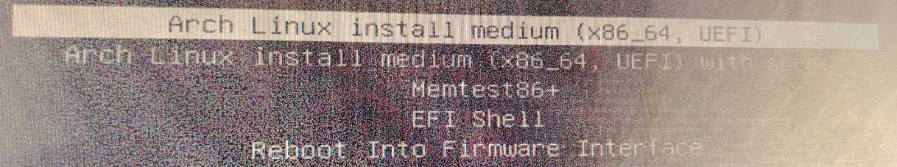
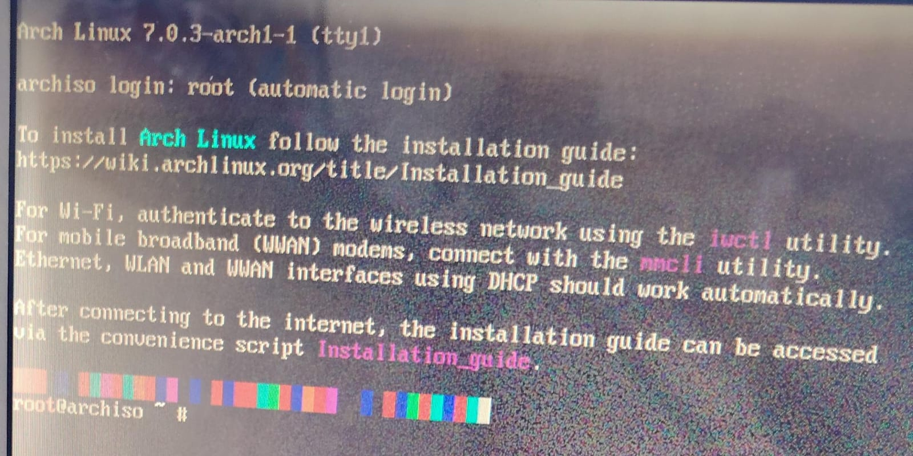

# ADVERTENCIA

Archinstall ofrece una variedad de configuraciones dependiendo de las necesidades del usuario. Debido a que el objetivo de esta pequeña guía es construir una instalación base lo más sencilla y comprensible posible, varias de estas opciones fueron omitidas o dejadas con su configuración predeterminada. Esto no significa que sean innecesarias, sino que por el momento pueden confundir a una persona que comienza en Arch Linux.

# Menú de arranque de Arch Linux

Después de iniciar el equipo desde la memoria USB, aparecerá el menú de arranque de Arch Linux. Este menú ofrece diferentes opciones para iniciar el entorno de instalación o realizar tareas específicas de diagnóstico y mantenimiento.

<p align="center">
  
</p>

Les daré una breve descripción de cada opción:

<p align="center"; style="font-size:20px;"> <ins>Arch Linux install medium (x86_64, UEFI)</ins>
</p>

Inicia el entorno de instalación estándar de Arch Linux en sistemas con firmware UEFI. Esta es la opción que escogí.

<p align="center"; style="font-size:20px;"> <ins>Arch Linux install medium (x86_64, UEFI) with speech</ins>
</p>

Inicia el entorno de instalación con soporte de síntesis de voz. Está diseñada para mejorar la accesibilidad y facilitar la instalación a usuarios con discapacidad visual.

<p align="center"; style="font-size:20px;"> <ins>Memtest86+</ins>
</p>

Ejecuta una herramienta de diagnóstico de memoria RAM. Permite detectar errores físicos o problemas de estabilidad en los módulos de memoria antes de instalar el sistema operativo. Se recomienda utilizar esta opción únicamente cuando se sospeche de fallos de hardware relacionados con la memoria.

<p align="center"; style="font-size:20px;"> <ins>EFI Shell</ins>
</p>

Abre una consola de bajo nivel proporcionada por el firmware UEFI. Está orientada a tareas avanzadas de administración, diagnóstico y recuperación del sistema.

<p align="center"; style="font-size:20px;"> <ins>Reboot Into Firmware Interface</ins>
</p>

Reinicia el equipo y accede directamente a la configuración del firmware UEFI (BIOS), permitiendo modificar parámetros como el orden de arranque, la configuración de discos, opciones de seguridad o ajustes del hardware.


# Puesta en marcha del instalador

Se debe conectar un cable Ethernet al equipo, puesto que permitirá que el instalador descargue los paquetes más recientes y actualice los componentes necesarios durante el proceso de instalación.

<p align="center">
  
</p>


Cuando inicie el entorno de Arch Linux desde la memoria USB, ejecutaremos los siguientes comandos:

```bash
pacman -Sy
```
Actualiza la base de datos de paquetes disponibles en los repositorios oficiales.

```bash
pacman -Sy archlinux-keyring
```

Actualiza las claves criptográficas utilizadas para verificar la autenticidad e integridad de los paquetes descargados.

```bash
archinstall
```

Inicia el instalador guiado oficial de Arch Linux.


# Archinstall

Aunque Archinstall no dispone de una interfaz gráfica tradicional, como otras distribuciones de Linux y Windows, su funcionamiento es bastante intuitivo. La navegación se realiza mediante el teclado y, en la parte inferior de la pantalla, se muestran las teclas disponibles para desplazarse entre las distintas opciones y confirmar selecciones.

<p align="center"; style="font-size:20px;"> <ins> Archinstall Language</ins>
</p>

<p style="font-size:15px;"> <ins>Language: English</ins>
</p>

Se recomienda utilizar el idioma inglés debido a que gran parte de la documentación oficial, mensajes de error y recursos de soporte de Arch Linux se encuentran en este idioma. Además, no todos los idiomas, incluyendo español, son 100% traducidos.


<p align="center"; style="font-size:20px;"> <ins> Locales</ins>
</p>

Las configuraciones regionales determinan el idioma del sistema, el formato de fechas y la distribución del teclado.

<p style="font-size:15px;"> <ins>Keyboard Layout</ins>
</p>

```text
es
```

Para configurar el teclado con distribución en español.

<p style="font-size:15px;"> <ins>Locale Language
</ins>
</p>

```text
es_MX.UTF-8
```

Define el idioma principal del sistema para México. En otros países deberá seleccionarse la variante correspondiente.

<p style="font-size:15px;"> <ins>Locale Encoding
</ins>
</p>


```text
UTF-8
```

Se establece la codificación de caracteres estándar utilizada actualmente por la mayoría de sistemas operativos.


<p align="center"; style="font-size:20px;"> <ins> Mirrors and Repositories</ins>
</p>

Los mirrors son servidores encargados de distribuir los paquetes oficiales de Arch Linux.

<p style="font-size:15px;"> <ins>Select Regions
</ins>
</p>

```text
Mexico
United States
```

Seleccionar regiones cercanas permite obtener mayores velocidades de descarga y una mejor disponibilidad de paquetes.

<p style="font-size:15px;"> <ins>Add Custom Servers
</ins>
</p>

```text
-
```
<p style="font-size:15px;"> <ins>Optional Repositories
</ins>
</p>

```text
-
```

<p style="font-size:15px;"> <ins>Add Custom Repository
</ins>
</p>

```text
-
```


<p align="center"; style="font-size:20px;"> <ins> Disk Configuration</ins>
</p>

Se define cómo se organizará el almacenamiento del sistema.

<p style="font-size:15px;"> <ins>Partitioning
</ins>
</p>

#### "Select a disk configuration"

```text
Use a best-effort default partition layout
```

Permite que Archinstall genere automáticamente una estructura de particiones recomendada.

En este caso se selecciona porque el disco estará dedicado exclusivamente a Arch Linux y no coexistirá con otros sistemas operativos.

Posteriormente se selecciona el disco o unidad SSD donde será instalado el sistema.

#### "Select Main Filesystem"

```text
btrfs
```

"btrfs" es un sistema de archivos moderno que ofrece ventajas importantes para unidades SSD, como snapshots, compresión transparente y una administración más eficiente del almacenamiento.


#### "Would you like to use BTRFS subvolumes with a default structure?"

```text
Yes
```

Permite utilizar la estructura recomendada de subvolúmenes, facilitando futuras tareas de mantenimiento y recuperación.

#### "Would you like to use compression or disable CoW?"

```text
Use compression
```

Activa la compresión transparente de datos, reduciendo el espacio utilizado en disco y mejorando el rendimiento en determinadas situaciones.

<p style="font-size:15px;"> <ins>LVM
</ins>
</p>


```text
-
```
<p style="font-size:15px;"> <ins>Disk Encryption
</ins>
</p>

```text
-
```
<p style="font-size:15px;"> <ins>Btrfs Snapshots
</ins>
</p>

```text
-
```


<p align="center"; style="font-size:20px;"> <ins> Swap</ins>
</p>

La memoria Swap sirve como respaldo cuando la memoria RAM disponible resulta insuficiente.

<p style="font-size:15px;"> <ins>Swap on zram
</ins>
</p>

```text
Enabled
```

Utiliza compresión en memoria para optimizar el uso de RAM y reducir accesos al almacenamiento físico.

<p style="font-size:15px;"> <ins>Compression Algorithm
</ins>
</p>

```text
zstd
```

Algoritmo moderno de compresión que ofrece un excelente equilibrio entre velocidad y eficiencia.


<p align="center"; style="font-size:20px;"> <ins> Bootloader</ins>
</p>

El bootloader es el componente responsable de iniciar el sistema operativo.

<p style="font-size:15px;"> <ins>Bootloader
</ins>
</p>

```text
Systemd-boot
```

Se selecciona por ser una alternativa ligera, moderna y perfectamente integrada con sistemas UEFI.

<p style="font-size:15px;"> <ins>UKI
</ins>
</p>

```text
Enabled
```

Unified Kernel Image (UKI) mejora la organización del arranque y facilita la integración con mecanismos modernos de seguridad.


<p align="center"; style="font-size:20px;"> <ins> Kernels</ins>
</p>

<p style="font-size:15px;"> <ins>Kernel
</ins>
</p>

```text
linux
```

Instala el kernel estándar de Arch Linux, recomendado para la mayoría de usuarios.


<p align="center"; style="font-size:20px;"> <ins> Hostname</ins>
</p>
<p style="font-size:15px;"> <ins>Hostname
</ins>
</p>

```text
Marc_OS
```

Nombre que identificará al equipo dentro del sistema y en redes locales.

<p align="center"; style="font-size:20px;"> <ins> Authentication</ins>
</p>

<p style="font-size:15px;"> <ins>Root Password
</ins>
</p>

```text
123
```

Se establece una contraseña para el usuario administrador (root). Como recomendación es mejor utilizar una contraseña robusta y difícil de adivinar, ya que esta cuenta posee control total sobre el sistema.

<p style="font-size:15px;"> <ins>User Account
</ins>
</p>

#### "Add a User"

```text
marcos
```

Usuario principal que será utilizado diariamente.

#### "Enter a Password"

```text
12345
```

Se asigna una contraseña para dicho usuario. Como recomendación es mejor utilizar una contraseña diferente a la cuenta root para incrementar la seguridad del sistema.

#### "Should "marcos" be a superuser (sudo)?"

```text
Yes
```

Permite ejecutar tareas administrativas mediante el comando `sudo` sin necesidad de iniciar sesión directamente como root.

<p style="font-size:15px;"> <ins>U2F Login Setup
</ins>
</p>

```text
No U2F devices found
```

No se detectaron dispositivos de autenticación física compatibles.


<p align="center"; style="font-size:20px;"> <ins> Profile</ins>
</p>

```text
-
```

Este apartado será reservado para la siguiente fase de la instalación: Entorno gráfico.


<p align="center"; style="font-size:20px;"> <ins> Applications</ins>
</p>

<p style="font-size:15px;"> <ins>Bluetooth
</ins>
</p>

```text
Yes
```

Instala y configura soporte para dispositivos Bluetooth.

<p style="font-size:15px;"> <ins>Audio
</ins>
</p>

#### "Select Audio Configuration"

```text
pipewire
```

PipeWire es la solución de audio moderna recomendada para sistemas Linux actuales, proporcionando compatibilidad con aplicaciones multimedia y profesionales.

<p style="font-size:15px;"> <ins>Print Service
</ins>
</p>

```text
-
```

<p style="font-size:15px;"> <ins> Firewall
</ins>
</p>

```text
-
```

<p style="font-size:15px;"> <ins> Additional Fonts
</ins>
</p>

```text
-
```


<p align="center"; style="font-size:20px;"> <ins> Network Configuration</ins>
</p>

#### "Choose Network Configuration"

```text
Use Network Manager (default backend)
```

Permite administrar conexiones Ethernet, Wi-Fi y VPN mediante una interfaz sencilla y ampliamente compatible.


<p align="center"; style="font-size:20px;"> <ins> Pacman
</ins>
</p>

<p style="font-size:15px;"> <ins> Color
</ins>
</p>

```text
True
```

Habilita colores en la salida del gestor de paquetes para mejorar la legibilidad.


<p align="center"; style="font-size:20px;"> <ins> Additional Packages
</ins>
</p>

```text
-
```


<p align="center"; style="font-size:20px;"> <ins> Timezone
</ins>
</p>

<p style="font-size:15px;"> <ins> Select Timezone
</ins>
</p>

```text
America/Mexico_City
```

Configura correctamente la zona horaria del sistema.


<p align="center"; style="font-size:20px;"> <ins> Automatic Time Sync (NTP)
</ins>

</p>
<p style="font-size:15px;"> <ins> NTP
</ins>
</p>


```text
Enabled
```

Permite sincronizar automáticamente la fecha y hora utilizando servidores de tiempo en Internet.


# Instalación del sistema

Para concluir, seleccionar:

```text
Install
```

Archinstall mostrará un resumen completo de todas las opciones elegidas.

Posteriormente aparecerá el mensaje:

```text
The specified configuration will be applied.
Would you like to continue?
```

Después de verificar que la configuración es correcta, seleccionar:

```text
Yes
```

El instalador comenzará a descargar e instalar todos los paquetes necesarios para generar el sistema operativo.
<p align="center">
  
</p>


# Instalación de herramientas básicas

Cuando la instalación concluya aparecerá la pregunta:

```text
What would you like to do next?
```

Seleccionar:

```text
Exit archinstall
```

Antes de reiniciar, instalaremos las utilidades fundamentales de Linux:

```bash
pacman -S coreutils
```

Cuando aparezca la confirmación:

```text
Proceed with installation? [Y/n]
```

Responder:

```text
Y
```

Este paquete incluye herramientas esenciales utilizadas diariamente en Linux, entre ellas:

* ls
* cp
* mv
* cat
* mkdir
* pwd
* rm
* chmod
* chown

entre muchas otras.


# Reinicio del sistema

Finalmente, reiniciar el equipo mediante:

```bash
reboot
```

Es importante retirar la memoria USB cuando el sistema se apague o durante el arranque para evitar volver a ingresar al instalador.

# Avancemos a la última fase: Entorno gráfico

<p align="center">
  
</p>
