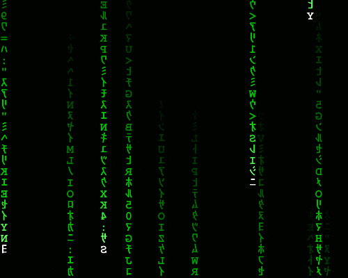

    <strong>¿Eres nuevo en Linux o quieres comenzar un nuevo mundo?</strong>

 <u>¡Aquí aprenderás los comandos básicos para adentrarnos en el maravilloso mundo de Linux!</u>

# ¿Qué es Arch Linux?

  

Es una distribución GNU/Linux enfocada en la simplicidad y control total del sistema desde el inicio.
Su filosofía la describen como:

> "A simple, lightweight distribution."
(Una distribución simple y ligera).

Para más información, puedes consultar la página oficial de Arch Linux: https://archlinux.org/

# RECOMENDACIONES
* Es necesario tener tiempo y paciencia. Como dice el dicho:

>"Roma no se hizo en un día."

* Investiga en varias fuentes confiables acerca de esta distribución.
* La comunidad de Arch Linux es muy activa y siempre está dispuesta a ayudar.
* La documentación oficial es una de las mejores del ecosistema Linux: https://wiki.archlinux.org/title/Main_page

# ADVERTENCIA
La instalación mostrada en esta documentación fue realizada de forma nativa, es decir, directamente sobre una unidad de almacenamiento física.

# REQUISITOS

* Memoria USB.
* Unidad de almacenamiento:
  * HDD
  * SSD
  * NVMe
* Conexión a Internet.
* Cable Ethernet (recomendado).

# FASES

La implementación de esta distribución se dividirá en 3 partes:

1. Descargas.
2. Instalación.
3. Entorno gráfico.

UN
GRAN
PODER...

  

